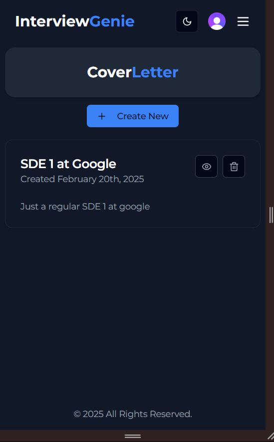
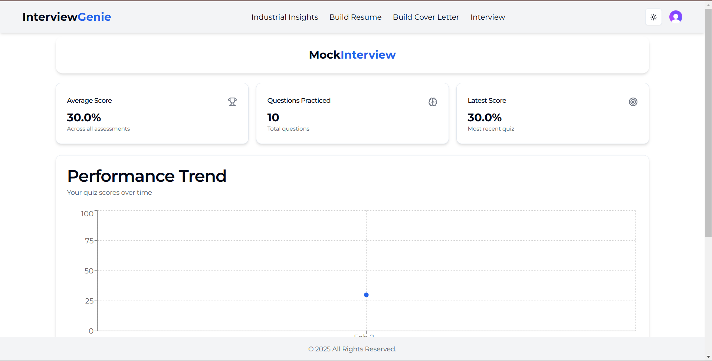

## Interview Genie (Your AI Powered Interview Helper)

A powerful AI Powered platform where you can see the industry trends for you technology domain
You can create AI powered resumes
Test your skills using AI powered quizzes and
Design cover-letters for applying to different jobs

### Tech Stack Used

1. NextJs as a full stack framework
2. Clerk for handleing auth stuff
3. Gemini for AI features
4. Prisma as ORM
5. PostgresSQL as DB
6. ShadCn and Tailwind for styling
7. Inngest for cron jobs
8. Recharts for charts
9. Zod and React Hook Forms for handling forms and validations

### Youtube Video Regarding The Project

<a href="https://youtu.be/HlGIu92LYOI">Youtube</a>

### Live Link

<a href="https://interview-genie-snowy.vercel.app/">Live Link</a>
Sample Credentials:
Email:jjdd@fearlessmails.com
Username:johndoe
Password:Ascvbn12#

## Project Screenshots

### How to run the projects

1. Clone the Projects
2. Run `pnpm i ` to install the dependencies
3. Create and .env file fill the required details as specified in .env.sample
4. `pnpm run dev` to start the project

### Some important prisma commands

pnpx prism init
pnpx prisma migrate dev --name created models
